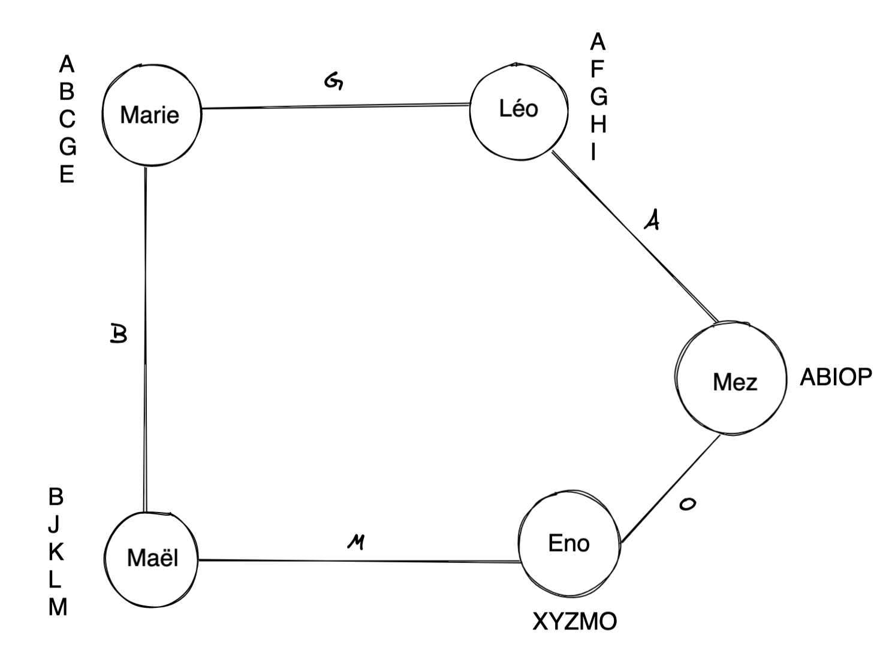
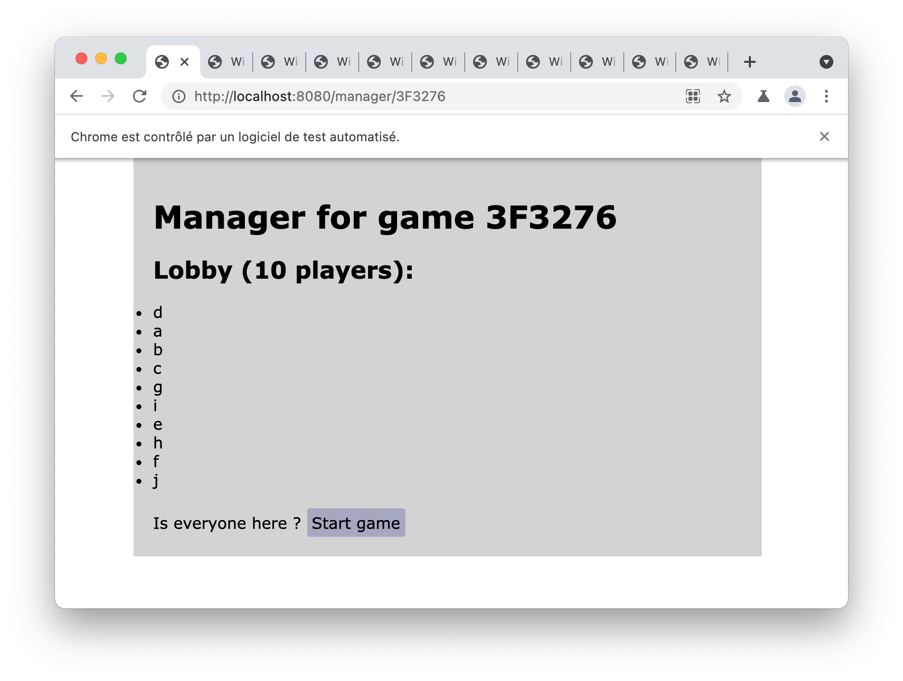

# WithB
An *IRL* interactive roleplay game to learn how to cheat on your relatives. 

> Who is that ho* Bryan ?!

## Rules

1) Each person is in a relationship with 2 people.

2) Everyone knows the 2 ones they are in a relationship with like if you were part of a circle where you only know the person on your right and your left.

3) You (and your relations) have to guess with whom they are being cheated on with.

4) You have at least 1 common trait with the ones you are in a relationship with.

## Example

This is an example of a solution, only the game knows this graph.
Here, there are 5 people playing.

In this example, Léo has to find with whom Marie is cheating on him (the answer is Maël) and with whom Meziane is cheating on him too (the answer is Enora)

Meziane has to find with whom Léo is cheating on him (Marie) and with whom Enora is cheating on him too (Maël).

The capital letters are **personal traits**.
You have at leats **1 common trait** with a person you are in a relationship with.

# Contributing

## Installation
- Clone the repository and navigate to the folder
- Install the dependencies : `npm install`
- Run the development server : `npm run dev`

## Testing
You can simulate a game with 10 players and see both the manager and the player view.

- Run the test script to create a fake game : `npm run test`

